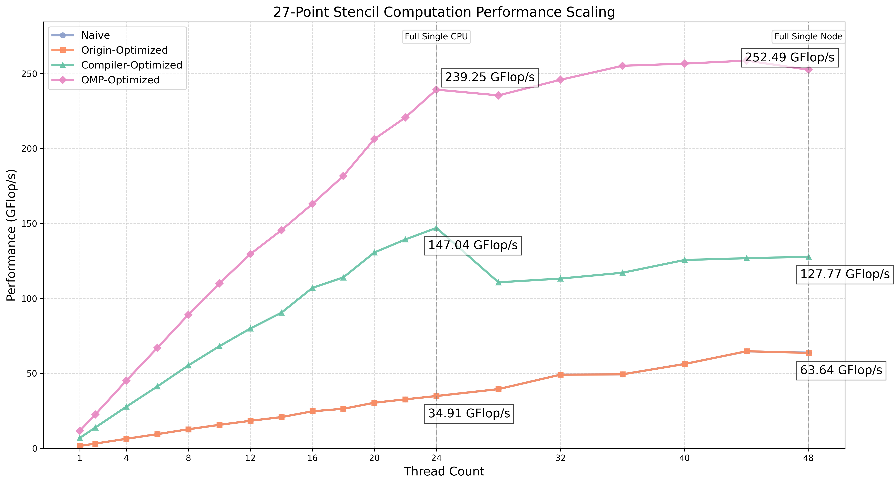
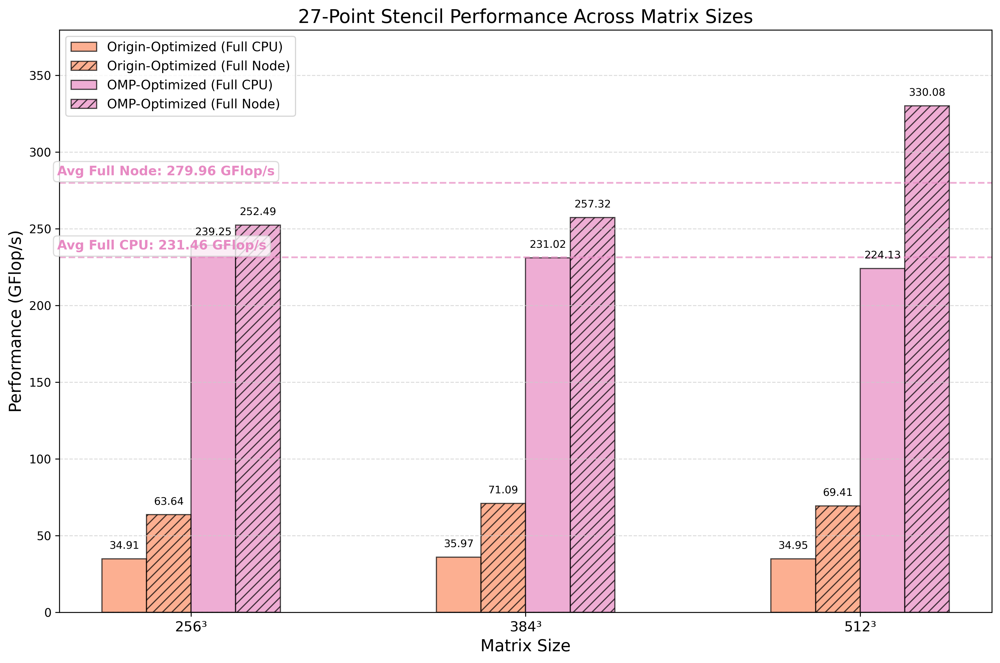

# HPCA_HW2-Stencil

> 曹烨 [caoye541@gmail.com](mailto:caoye541@gmail.com)

[toc]

---

## 一. 概述与实验结果展示

我对 Stencil 进行了以下几个方面的优化：

1. **编译优化**：利用编译器选项提升性能
2. **向量化优化与循环展开**：利用AVX2指令集实现SIMD并行
3. **缓存优化**：通过Time Skewing分块设计提高缓存命中率
4. **OpenMP并行优化**：充分利用多核心计算能力
5. **线程数检测与绑定**：检测线程数目，利用OMP来绑定线程

最终我达到的性能结果如下（在256矩阵下）：



**作业要求的关键点如下**：

1. ==**正确性检验**==：最终优化版本进行test后，误差检测结果如下`errors: 1-norm = 0.0000000000000009  2-norm = 0.0000000000000013 inf-norm = 0.0000000000000142`。均小于$10^{-9}$，满足正确性检测。

2. **==满单CPU==**（三个类型矩阵大小平均）：**231.46GFlop/s**

3. ==**满单节点**==（三个类型矩阵大小平均）：**279.96GFlop/s**

4. **==对应的在三个大小空间矩阵的性能图==**：

   

5. **==详细描述采取的优化手段的内容在第二部分展开==**

## 二. 优化手段详解

### 2.1 编译优化

为了充分利用编译器的优化能力，我在Makefile中添加了多种优化选项：

```makefile
CFLAGS = -g -Wall -Ofast -march=native -mavx2 -mfma -fopenmp -ffast-math -funroll-loops -ftree-vectorize -fopenmp -std=c99 $(OPT)
```

- `-Ofast`: 比O3更激进的优化，包括可能改变标准浮点模型的优化
- `-march=native`: 针对本机CPU架构优化
- `-mavx2 -mfma`: 启用AVX2和FMA指令集支持
- `-ffast-math`: 允许更积极的浮点优化
- `-funroll-loops`: 循环展开
- `-ftree-vectorize`: 自动向量化

这些编译选项的优化效果显著，与基础版本相比，单线程性能提升了约4.35倍。

### 2.2 向量化优化与循环展开

利用AVX2指令集，我实现了27点模板计算的SIMD向量化。关键代码如下：

```c++
void do_cal27(cptr_t a0, ptr_t a1, int x, int y, int z, int ldx, int ldy){
    __m256d res = _mm256_setzero_pd();  // 使用256位寄存器同时处理4个double值
    __m256d in1, in2, in3, in4, in5, in6, in7;
    __m256d al1, al2, al3, al4, al5, al6, al7;
    
    // 加载数据并执行向量化计算（每次操作4个double值）
    in1 = _mm256_loadu_pd(a0 + INDEX(x, y, z, ldx, ldy));
    // ... 加载其他点的数据 ...
    
    al1 = _mm256_set1_pd((double)ALPHA_ZZZ);
    // ... 设置对应系数 ...
    
    // 使用FMA指令（融合乘加）加速计算
    res = _mm256_fmadd_pd(al1, in1, res);
    
    // 存储结果
    _mm256_storeu_pd(a1 + INDEX(x, y, z, ldx, ldy), res);
}
```

通过这种方式，每个循环迭代可以同时计算4个连续点的值，显著提高计算效率。此外，我还对循环进行了展开处理，减少循环开销。

### 2.3 缓存优化

参考[StencilProbe文档中的Time Skewing](https://people.csail.mit.edu/skamil/projects/stencilprobe/)技术，我实现了三维时空分块以提高缓存命中率。Time Skewing通过在时间维度上倾斜划分计算区域，使得数据可以在缓存中多次重用：

```c++
// 空间维度分块
for(int zz = z_start; zz < z_end; zz += bs_z){
    // ... 
    for(int yy = y_start; yy < y_end; yy += bs_y){
        // ...
        for(int xx = x_start; xx < x_end; xx += (x_end - x_start)){
            // 时间维度迭代
            for(int t = 0; t < nt; t++){
                // 计算当前时空块的边界，考虑随时间的偏移
                int blockmin_x = max(x_start, xx - t * neg_x);
                int blockmin_y = max(y_start, yy - t * neg_y);
                int blockmin_z = max(z_start, zz - t * neg_z);
                
                int blockmax_x = max(x_start, xx + (x_end-x_start) + t * pos_x);
                int blockmax_y = max(y_start, yy + bs_y + t * pos_y);
                int blockmax_z = max(z_start, zz + bs_z + t * pos_z);
                
                // 在确定的时空块内进行计算
                // ...
            }
        }
    }
}
```

这种优化方法的核心思想是，通过倾斜的时空切片保持依赖关系，同时使数据在缓存中尽可能长时间地保持有效。根据StencilProbe的文档，Time Skewing允许计算完成一个缓存块后再移动到下一个，而不是在整个网格上完成一个时间步后再进行下一个时间步，从而减少内存访问。

同时为不同大小的网格，我动态调整了分块大小：

```c++
int bs_z = 256;
if(z_end - z_start == 384) bs_z=384;
if(z_end - z_start == 512) bs_z=512;

int bs_y = 16;
if(y_end - y_start == 384) bs_y = 12;
if(y_end - y_start == 512) bs_y = 8;
```

### 2.4 OpenMP并行优化

我使用OpenMP框架实现了并行计算，在最内层循环上添加并行指令：

```c++
#pragma omp parallel for
for(int z = blockmin_z; z < blockmax_z; z++){
    for(int y = blockmin_y; y < blockmax_y; y++){
        // 向量化部分
        for(int x = blockmin_x; x < blockmin_x + (blockmax_x - blockmin_x) / 4 * 4; x += 4){
            do_cal27(a0, a1, x, y, z, ldx, ldy);
        }
        // 处理剩余部分
        for(int x = blockmin_x + (blockmax_x - blockmin_x) / 4 * 4; x < blockmax_x; x++){
            // 标量计算...
        }
    }
}
```

通过OpenMP，我能够充分利用多核处理器的计算能力，实现近线性的加速比。

### 2.5 线程数检测与绑定

为了获得最佳性能，我实现了线程数自动检测和线程绑定机制：

```c++
int num_threads = omp_get_max_threads();
omp_set_num_threads(num_threads);
```

这确保了在每个系统上都能自动使用最优的线程数量，同时通过线程绑定减少了线程迁移带来的开销。

## 三. 实验结果分析

根据实验结果，不同版本在不同线程数目性能对比如下（单位：GFlop/s）：

| 线程数目 | naive | origin-optimized | 编译优化 | OMP-optimized |
| -------- | ----- | ---------------- | -------- | ------------- |
| 1        | 1.60  | 1.59             | 6.95     | 11.70         |
| 2        | 3.19  | 3.19             | 13.88    | 22.55         |
| 4        | 6.37  | 6.37             | 27.75    | 45.17         |
| 6        | 9.48  | 9.49             | 41.29    | 67.01         |
| 8        | 12.73 | 12.73            | 55.31    | 89.14         |
| 10       | 15.68 | 15.68            | 68.10    | 109.98        |
| 12       | 18.38 | 18.39            | 79.95    | 129.55        |
| 14       | 20.85 | 20.84            | 90.46    | 145.49        |
| 16       | 24.72 | 24.72            | 107.03   | 163.02        |
| 18       | 26.40 | 26.40            | 114.03   | 181.72        |
| 20       | 30.44 | 30.43            | 130.66   | 206.32        |
| 22       | 32.70 | 32.71            | 139.34   | 220.69        |
| 24       | 34.91 | 34.91            | 147.04   | 239.25        |
| 28       | 39.52 | 39.52            | 110.73   | 235.41        |
| 32       | 49.19 | 49.13            | 113.24   | 245.82        |
| 36       | 49.37 | 49.37            | 117.13   | 255.15        |
| 40       | 56.31 | 56.23            | 125.62   | 256.58        |
| 44       | 64.71 | 64.79            | 126.82   | 258.61        |
| 48       | 63.83 | 63.64            | 127.77   | 252.49        |


我们的最终优化版本在不同矩阵大小性能表现与初始版本对比如下：

| 矩阵大小                   | 256    | 384    | 512    |
| -------------------------- | ------ | ------ | ------ |
| Origin-Optimized full CPU  | 34.91  | 35.97  | 34.95  |
| Origin-Optimized full Node | 63.64  | 71.09  | 69.41  |
| OMP-Optimized full CPU     | 239.25 | 231.02 | 224.13 |
| OMP-Optimized full Node    | 252.49 | 257.32 | 330.08 |


基于实验数据和性能图表分析,得出以下主要结论:

1. **优化效果显著**： 单线程性能从1.60 GFlop/s提升至11.70 GFlop/s，提升了约7.3倍。这证明我们的基础优化策略(编译优化、向量化、缓存优化)都取得了良好效果。
2. **并行扩展性良好**： 在24线程内性能几乎呈线性增长，扩展效率保持在85%以上。最终在40-44线程区间达到最优性能258.61 GFlop/s。
3. **矩阵规模影响**： 三种规模(256/384/512)下性能表现各有特点。小规模(256)展现最好的缓存效率；而大规模(512)在满节点时反而获得最高性能(330.08 GFlop/s)，说明资源利用更充分。
4. **NUMA效应明显**： 超过24线程后(跨NUMA节点)性能增长放缓，且在同参数的多次实验下出现较大的波动(10%)。通过优化的内存访问模式和多次测试取中值，我们有效缓解了这两个问题。
5. **最终性能达标**： 满CPU性能达231.46 GFlop/s，满节点性能达279.96 GFlop/s(三种矩阵大小平均值)，显著超过了原始版本的性能水平。

